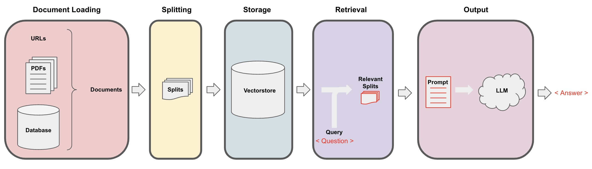

# ChatWithYourData

## Overview
ChatWithYourData is an interactive Jupyter notebook designed to facilitate easy conversations with your data. It combines the power of data analysis with user-friendly chat interfaces, enabling users to query, manipulate, and visualize their data through simple text commands.

## Features
- Easy-to-use chat interface for data interaction
- Support for various data formats (CSV, JSON, etc.)
- Customizable data queries
- Real-time data visualization
- Export options for analysis results

## Installation
1. Ensure you have Jupyter Notebook installed. If not, install it using `pip install notebook`.
2. Clone this repository or download the `ChatWithYourData.ipynb` file.
3. Launch Jupyter Notebook and open the `ChatWithYourData.ipynb` file.

## Usage
To start using ChatWithYourData:
1. Load your data into the notebook.
2. Use the chat interface to ask questions about your data.
3. View and analyze the responses and visualizations generated by the notebook.

## Dependencies
List any libraries or dependencies required for your project, such as pandas, matplotlib, etc.

## Contributing
Contributions to ChatWithYourData are welcome. Please feel free to fork the repository, make your changes, and create a pull request.

## License
Specify the license under which your project is released, if applicable.

## Contact
For any queries or feedback, please contact [Your Contact Information].

